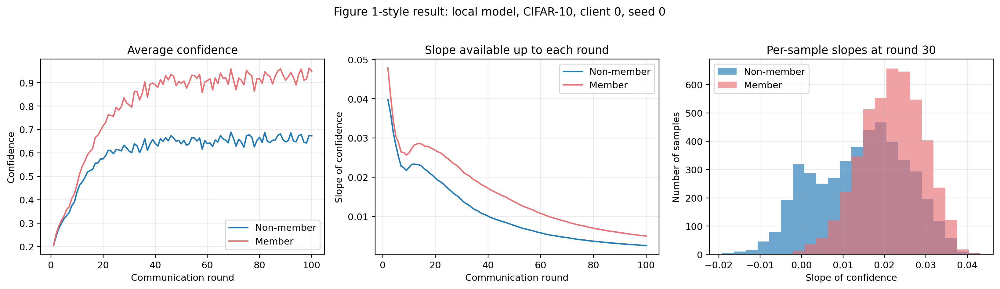
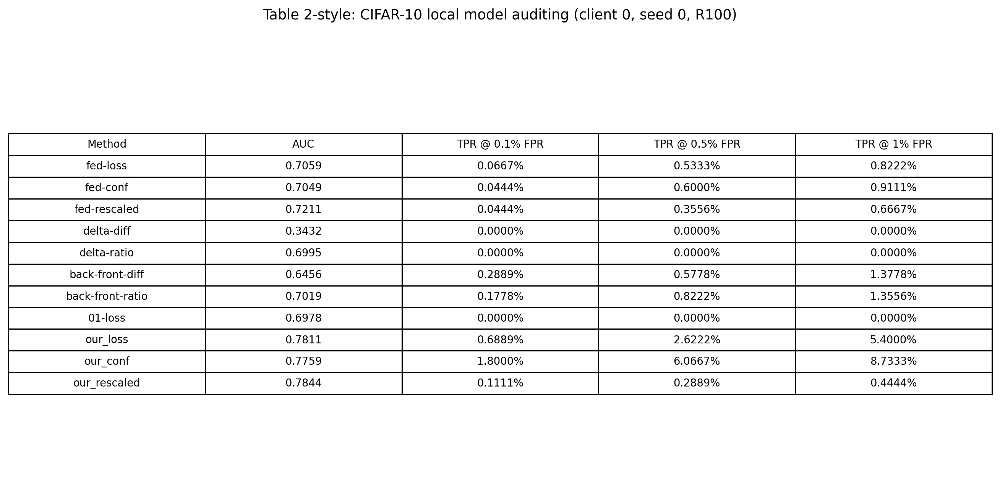
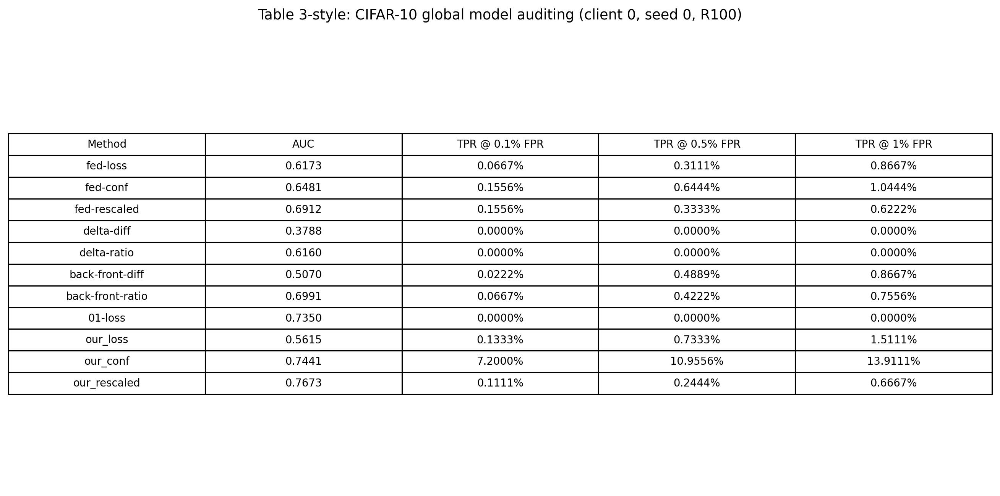
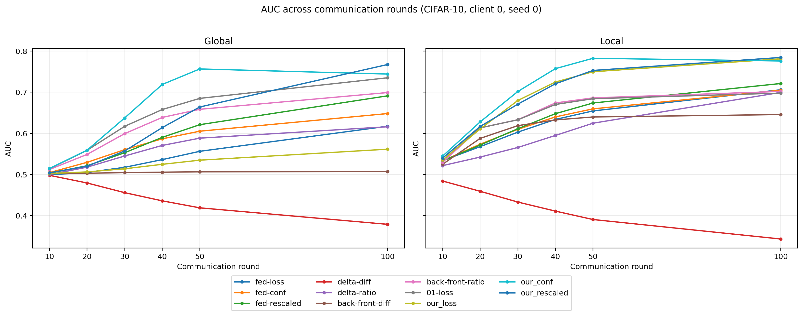
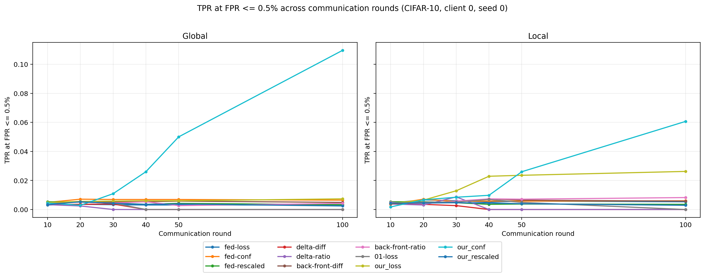

# Efficient Privacy Auditing in Federated Learning：复现报告

> 论文：**Efficient Privacy Auditing in Federated Learning**（USENIX Security 2024）  
> 官方代码：[changhongyan123/privacy_auditing_in_FL](https://github.com/changhongyan123/privacy_auditing_in_FL)  
> 论文页面：[USENIX Security 2024](https://www.usenix.org/conference/usenixsecurity24/presentation/chang)

## 1. 复现工作概述

本项目在 WSL2 环境下复现论文提出的联邦学习隐私审计（Federated Training-time Auditing，FTA）流程。目标不是只运行一次代码，而是完成从**数据划分、联邦训练、逐轮轨迹保存、成员推断审计到结果可视化**的完整链路。

本次已完成的工作：

- 在 WSL2 + NVIDIA GeForce RTX 3050（4 GB 显存）上配置 PyTorch、CUDA、OpenMPI、mpi4py 与修改版 FedML；
- 使用 CIFAR-10、ResNet56、FedAvg、4 个客户端完成 100 轮联邦训练；
- 保存客户端 0 在每轮的 global / local 模型逐样本预测轨迹；
- 分别审计 global 与 local 模型，并比较 11 种审计分数；
- 复现论文风格的轨迹图、斜率分布图、local/global 结果表，以及 AUC / 低 FPR TPR 随轮数变化图；
- 增加输出目录命名、图表生成与效率计时汇总脚本，防止不同实验相互覆盖。

本复现实验的主要配置如下：

| 项目 | 设置 |
|---|---|
| 数据集 | CIFAR-10 |
| 数据划分 | IIDK，训练比例 0.3，population/reference 比例 0.4 |
| 联邦算法 | FedAvg |
| 模型 | ResNet56 |
| 客户端数 | 4 |
| 通信轮数 | 100 |
| 本地 epoch | 1 |
| 训练 batch size | 32 |
| 测试 batch size | 64 |
| 优化器 | Adam |
| 学习率 / 权重衰减 | 0.001 / 0.0001 |
| 随机种子 | 0 |
| 审计对象 | client 0 的 global / local 模型 |

---

## 2. 方法简述

在每个通信轮后，项目会让目标模型对客户端 0 的三类样本进行逐样本预测：

- `train`：该客户端真正参与训练的样本，记为成员；
- `test`：未参与该客户端训练的样本，记为非成员；
- `rest`：额外的非成员参考集，用于构造参考分布。

对每个样本，保存其跨轮变化的 `loss`、正确类别 `confidence`、`rescaled logit` 与预测正确性。审计阶段利用这些轨迹构造分数，并扫描阈值得到 ROC、AUC 和低 FPR 下的 TPR。

论文提出的 FTA 分数在代码中对应：

- `our_loss`：loss 跨通信轮的线性趋势斜率；
- `our_conf`：正确类别置信度跨通信轮的线性趋势斜率；
- `our_rescaled`：rescaled logit 跨通信轮的线性趋势斜率。

成员样本通常被模型学习得更快，因此其轨迹斜率与非成员存在分布差异；差异越易区分，成员推断风险越高。

---

## 3. 为完成复现所做的工程修改

| 修改 / 新增内容 | 目的 |
|---|---|
| `utilies.py` 输出命名补丁 | 将轮数、客户端数、seed、模型、batch size 等写入实验目录，避免不同实验覆盖 |
| `plot_reproduction_results.py` | 从审计 CSV 与预测轨迹中生成论文风格图表和表格 |
| `summarize_efficiency.py` | 汇总本地训练、轨迹采集和后处理审计时间 |
| `FedAVGTrainer.py` / `3_run_audit.py` 的计时补充 | 记录轨迹采集与后处理审计耗时 |
| `fl.test_batch_size=64` | 避免 4 个 MPI 客户端共享 4 GB GPU 时因默认测试批过大而停滞 |

> 注意：效率计时补充用于本机的工程比较，不等同于论文在 Titan RTX 上报告的官方 GPU 时间比。

---

## 4. 复现结果与分析

### 4.1 置信度轨迹与斜率分布

论文中：


本次复现：



图中以 client 0 的 local 模型为例：成员样本的平均 confidence 整体高于非成员；在第 30 轮时，成员的单样本 confidence 斜率分布整体更靠右。二者虽然存在重叠，但已形成可利用的区分信号。

### 4.2 Local 模型审计结果



在本次单次运行、client 0、100 轮的设置下：

- `our_rescaled` 的 AUC 为 **0.7844**；
- `our_loss` 的 AUC 为 **0.7811**；
- 在 `FPR ≤ 0.5%` 的严格条件下，`our_conf` 的 TPR 为 **6.0667%**，优于多数基线。

这说明 FTA 的轨迹斜率在本地模型审计中能够提供有效成员信号，但本实验不是论文的全客户端、5 次独立运行平均值。

### 4.3 Global 模型审计结果



在 global 模型上，`our_conf` 在低误报区间表现最强：

- `TPR @ 0.1% FPR = 7.2000%`；
- `TPR @ 0.5% FPR = 10.9556%`；
- `TPR @ 1% FPR = 13.9111%`。

该趋势与论文的核心观察一致：使用训练过程中的多轮轨迹，尤其是 confidence 的变化趋势，可以比仅观察最终模型或简单平均分数更有效地审计隐私风险。

### 4.4 随训练推进的风险变化





这两张图分别展示整体可分性（AUC）和严格低误报条件下的实际攻击能力（TPR@0.5% FPR）如何随通信轮数变化，并比较 global 与 local 模型。

---

## 5. 快速启动指南

### 5.1 环境

建议在 WSL2 / Linux 下运行，并确认以下组件可用：Python 3.9、PyTorch CUDA、OpenMPI、mpi4py、NumPy、Pandas、scikit-learn、Hydra、Matplotlib。

```bash
conda activate auditing_in_fl
nvidia-smi
```

### 5.2 数据划分

```bash
python 1_create_split.py \
  data=cifar10 random_seed=0 fl.num_parties=4
```

### 5.3 联邦训练

以下为本复现使用的安全测试批大小配置：

```bash
python 2_run_fl.py \
  data=cifar10 random_seed=0 num_gpus=1 \
  fl.num_parties=4 fl.model=resnet56 \
  fl.comm_round=100 fl.epochs=1 \
  fl.train_batch_size=32 fl.test_batch_size=64 fl.batch_size=32 \
  fl.learning_rate=0.001 fl.weight_decay=0.0001 \
  save_models=True save_client=0
```

完成标志为终端出现：

```text
Job is done
```

### 5.4 隐私审计

以第 100 轮（代码索引为 99）global 模型为例：

```bash
python 3_run_audit.py \
  data=cifar10 random_seed=0 \
  fl.num_parties=4 fl.model=resnet56 \
  fl.comm_round=100 fl.epochs=1 \
  fl.train_batch_size=32 fl.test_batch_size=64 fl.batch_size=32 \
  fl.learning_rate=0.001 fl.weight_decay=0.0001 \
  save_models=True save_client=0 \
  audit.party=0 audit.start_round=0 audit.target_round=99 \
  audit.target_model_type=global
```

将最后一行改成 `audit.target_model_type=local`，即可审计 client 0 的本地模型。

### 5.5 生成图表与表格

```bash
pip install matplotlib pandas
python plot_reproduction_results.py
```

生成结果保存在 `figures/`：

- `figure1_local_confidence_slope_hist.png`
- `table_2-style_local_cifar10.png`
- `table_3-style_global_cifar10.png`
- `auc_vs_rounds_global_local.png`
- `tpr_at_fpr_0_5_vs_rounds_global_local.png`

---

## 6. 可复现性与限制说明

1. 论文结果是跨客户端、5 次独立运行的平均；本仓库展示的是 **seed 0、client 0、单次运行** 的结果，因此不应期待逐项数值完全一致。
2. 相同随机种子可固定主要的数据划分与随机初始化，但 MPI 多进程调度、CUDA 非确定性算子、驱动与软件版本仍会造成数值差异。
3. 本机仅有 RTX 3050 4 GB 显存。4 个客户端共享 GPU 时，默认 `fl.test_batch_size=1000` 会造成资源压力；本复现使用 `64`。
4. 原始逐样本预测轨迹 `*_global_pred.jsonl`、`*_local_pred.jsonl` 与 CIFAR-10 原始数据体积较大，未提交至普通 Git 仓库；它们可通过上述训练命令重新生成。仓库保留最终审计 CSV、图表和配置文件作为复现实验产物。

---

## 7. 引用

```bibtex
@inproceedings{chang2024efficient,
  author    = {Hongyan Chang and Brandon Edwards and Anindya S. Paul and Reza Shokri},
  title     = {Efficient Privacy Auditing in Federated Learning},
  booktitle = {33rd USENIX Security Symposium (USENIX Security 24)},
  year      = {2024},
  pages     = {307--323},
  publisher = {USENIX Association}
}
```

## 致谢

本项目基于论文作者公开的实现进行复现，并使用 FedML 框架完成 MPI 联邦学习模拟。感谢原作者及 FedML 社区提供的开源代码。
