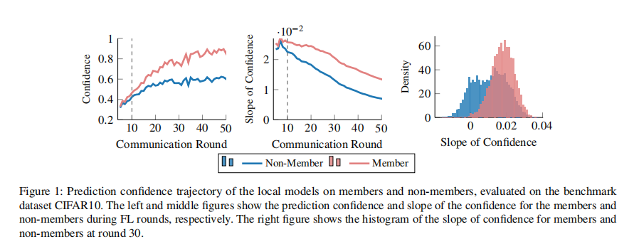
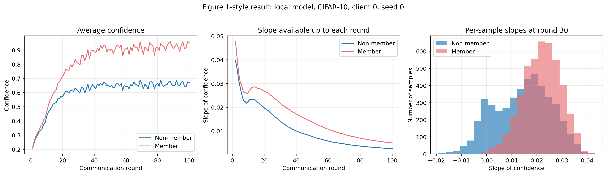
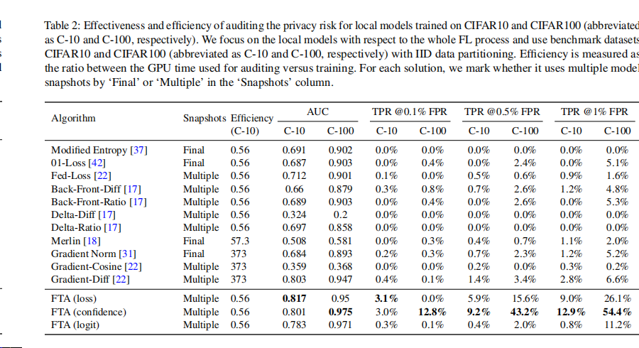
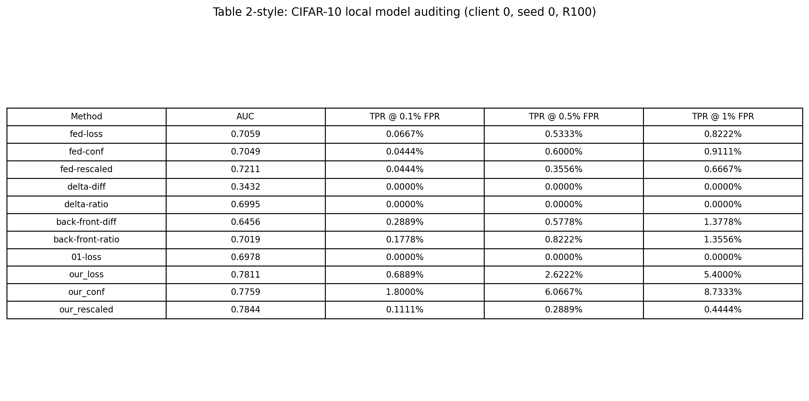
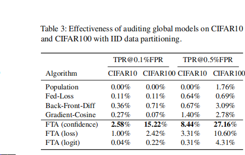
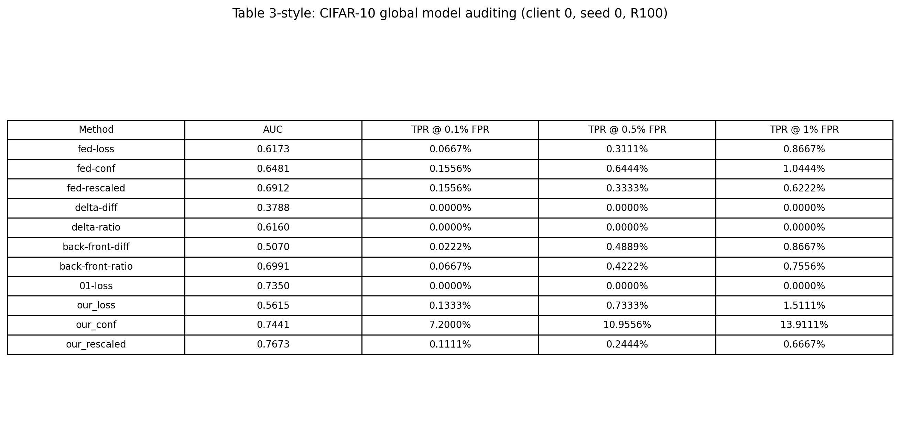
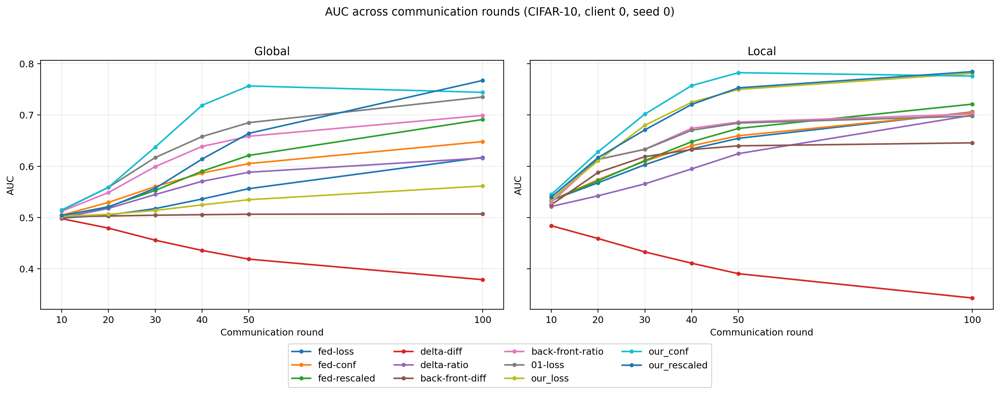
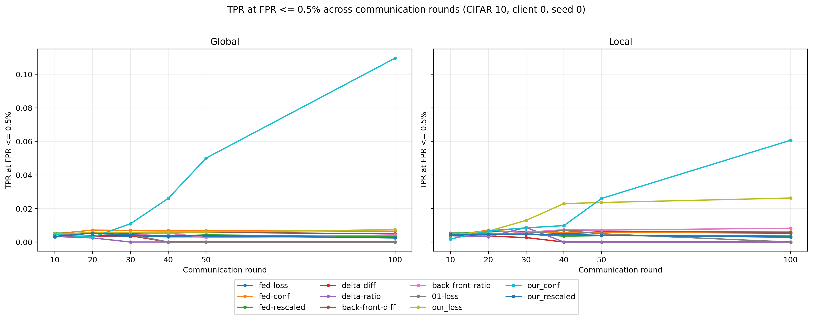

# Efficient Privacy Auditing in Federated Learning：复现报告

> 论文：**Efficient Privacy Auditing in Federated Learning**（USENIX Security 2024）  
> 官方代码：[changhongyan123/privacy_auditing_in_FL](https://github.com/changhongyan123/privacy_auditing_in_FL)  
> 论文页面：[USENIX Security 2024](https://www.usenix.org/conference/usenixsecurity24/presentation/chang)
> 
> 复现者：刘明鑫

## 1. 复现工作概述

本项目在 WSL2 环境下复现论文提出的联邦学习隐私审计（Federated Training-time Auditing，FTA）流程。目标是完成从**数据划分、联邦训练、逐轮轨迹保存、成员推断审计到结果可视化**的完整链路。

本次已完成的工作：

- 本实验的Python 环境定义文件environment.yml 是在 **Linux** 系统上导出的，所以本次复现再windows系统上下载了**WSL2**。又因为这份文件像是作者把他电脑上**好几个不同项目**的依赖混在一起导出的，**依赖互相打架**，而且它们要求的版本和这个项目真正需要的fedml要求的版本**互相冲突**，所以在本次复现中换成了适合本实验的精简环境文件 **environment-wsl2-minimal.yml**
- 使用 CIFAR-10、ResNet56、FedAvg、4 个客户端完成 100 轮联邦训练，**并且将fl.test_batch_size设置为64，因为使用默认值1000会造成资源压力导致实验在逐样本预测时陷入停滞。**
- 保存客户端 0 在每轮的 global / local 模型逐样本(包含train、test、rest)预测轨迹；
- 分别审计 global 与 local 模型，并比较 11 种审计分数；
- 复现论文风格的轨迹图、斜率分布图、local/global 结果表，以及 AUC / 低 FPR TPR 随轮数变化图；
- 改变输出目录命名，**防止不同轮数实验相互覆盖**；增加图表生成脚本。

本复现实验的主要配置如下：

| 项目 | 设置 |
|---|---|
| 数据集 | CIFAR-10 |
| 数据划分 | IIDK，train 0.3,test 0.3,rest 0.4 |
| 联邦算法 | FedAvg |
| 模型 | ResNet56 |
| 客户端数 | 4 |
| 通信轮数 | 100 |
| 本地 epoch | 1 |
| 训练 batch size | 32 |
| 测试 batch size | 64 |
| 优化器 | Adam |
| 学习率 / 权重衰减 | 0.001 / 0.0001 |
| 随机种子 | 0 |
| 审计对象 | client 0 的 global 和 local 模型 |

---

## 2. 方法简述

在每个通信轮后，项目会让目标模型对客户端 0 的三类样本进行逐样本预测：

- `train`：该客户端真正参与训练的样本，记为成员；
- `test`：未参与该客户端训练的样本，记为非成员；
- `rest`：额外的非成员参考集，用于构造参考分布。

对每个样本，保存其跨轮变化的 `loss`、正确类别 `confidence`、`rescaled logit` 与预测正确性等信息。审计阶段利用这些轨迹构造分数，并扫描阈值得到 ROC、AUC 和低 FPR 下的 TPR。

论文提出的 FTA 分数在代码中对应：

- `our_loss`：loss 跨通信轮的线性趋势斜率；
- `our_conf`：正确类别置信度跨通信轮的线性趋势斜率；
- `our_rescaled`：rescaled logit 跨通信轮的线性趋势斜率。

成员样本通常被模型学习得**更快**，因此其轨迹斜率与非成员存在分布差异；差异越易区分，成员推断风险越高。

---

## 3. 复现结果与分析

### 3.1 置信度轨迹与斜率分布

论文中：



本次复现：



图中以 client 0 的 local 模型为例：左图可看出成员样本的平均 confidence 整体高于非成员；中图可以看出成员样本confidence变化更快；在第 30 轮时，成员的单样本 confidence 斜率分布整体更靠右，二者虽然存在重叠，但已形成可利用的区分信号。

### 3.2 Local 模型审计结果

论文中：



本次复现：



在本次单次运行、client 0、100 轮的设置下：
- 在 `FPR 限制严格的条件下，`FTA` 的 TPR 优于大多数基线。

这说明 FTA 的轨迹斜率在本地模型审计中能够提供有效成员信号。

### 3.3 Global 模型审计结果

论文中：




本次复现：



在 global 模型上，`our_conf` 在低误报区间表现最强：

- `TPR @ 0.1% FPR = 7.2000%`；
- `TPR @ 0.5% FPR = 10.9556%`；
- `TPR @ 1% FPR = 13.9111%`。

该趋势与论文的一致：使用训练过程中的多轮轨迹，**尤其是 confidence 的变化趋势**，可以比仅观察最终模型或简单平均分数更有效地审计隐私风险。

### 3.4 随训练推进的风险变化





这两张图分别展示整体可分性（AUC）和严格低误报条件下的实际攻击能力（TPR@0.5% FPR）如何随通信轮数变化。由上面俩组图也可看出：在本次 CIFAR-10、4 客户端、client 0、seed 0 的复现实验中，FTA 的 `confidence slope`（`our_conf`）在 global 和 local 模型上均表现出最显著的低误报成员推断能力；但 FTA 的 loss 与 rescaled-logit 变体并非在所有设置下都优于其他方法，这一点论文所给表格也有所体现。

---

## 4. 快速启动指南

### 4.1 环境

建议在 WSL2 / Linux 下运行，并确认以下组件可用：Python 3.9、PyTorch CUDA、OpenMPI、mpi4py、NumPy、Pandas、scikit-learn、Hydra、Matplotlib。

```bash
conda activate auditing_in_fl
```

### 4.2 数据划分

```bash
python 1_create_split.py \
  data=cifar10 random_seed=0 fl.num_parties=4
```

### 4.3 联邦训练

fl.test_batch_size放弃默认值1000，改为64:

```bash
python 2_run_fl.py \
  data=cifar10 random_seed=0 num_gpus=1 \
  fl.num_parties=4 fl.model=resnet56 \
  fl.comm_round=100 fl.epochs=1 \
  fl.train_batch_size=32 fl.test_batch_size=64 fl.batch_size=32 \
  fl.learning_rate=0.001 fl.weight_decay=0.0001 \
  save_models=True save_client=0
```

完成标志为终端出现：

```text
Job is done
```

### 4.4 隐私审计

以第 100 轮（代码索引为 99）global 模型为例：

```bash
python 3_run_audit.py \
  data=cifar10 random_seed=0 \
  fl.num_parties=4 fl.model=resnet56 \
  fl.comm_round=100 fl.epochs=1 \
  fl.train_batch_size=32 fl.test_batch_size=64 fl.batch_size=32 \
  fl.learning_rate=0.001 fl.weight_decay=0.0001 \
  save_models=True save_client=0 \
  audit.party=0 audit.start_round=0 audit.target_round=99 \
  audit.target_model_type=global
```

将最后一行改成 `audit.target_model_type=local`，即可审计 client 0 的本地模型。

### 4.5 生成图表与表格

```bash
pip install matplotlib pandas
python plot_reproduction_results.py
```

生成结果保存在 `figures/`：

- `figure1_local_confidence_slope_hist.png`
- `table_2-style_local_cifar10.png`
- `table_3-style_global_cifar10.png`
- `auc_vs_rounds_global_local.png`
- `tpr_at_fpr_0_5_vs_rounds_global_local.png`

---

## 5. 可复现性与限制说明

1. 论文结果是跨客户端、5 次独立运行的平均；本仓库展示的是 **seed 0、client 0、单次运行** 的结果，因此不应期待逐项数值完全一致。
2. 本机仅有 RTX 3050 4 GB 显存。4 个客户端共享 GPU 时，默认 `fl.test_batch_size=1000` 会造成资源压力；本复现使用 `64`。
3. 原始逐样本预测轨迹 `0_global_pred.jsonl`、`0_local_pred.jsonl` 与 CIFAR-10 原始数据体积较大，未提交至普通 Git 仓库；它们可通过上述训练命令重新生成。仓库保留最终审计 CSV、图表和配置文件作为复现实验产物。


---
## 6. 方法解决的问题、局限与可行改进

### 6.1 方法解决了什么问题

本文主要研究联邦学习中的**成员隐私审计（Membership Privacy Auditing）**，即判断某条数据是否参与过模型训练。

传统成员推断方法在联邦学习中主要存在两类问题：一类只观察最终模型或少量模型快照，无法充分利用多轮训练过程中逐渐泄漏的成员信息；另一类虽然利用多轮信息，但需要计算单样本梯度、激活值或训练额外攻击模型，计算成本较高。

论文提出：

- **FTA（Free Training Attack）**：利用样本的 loss、confidence、rescaled logit 等指标在多个通信轮次上的变化轨迹，计算 **Slope Signal（斜率信号）**，根据成员与非成员被模型学习速度的差异进行成员推断。FTA不需要额外训练复杂攻击模型，因此兼顾了隐私审计效果和计算效率。
- **KTA（Knowledge Transfer Attack）**：在Slope Signal基础上进一步训练IN/OUT参考模型，并加入知识迁移约束，使参考模型尽量接近目标模型，以更多计算开销换取更强的成员推断能力。

核心思想可以概括为：

> **模型多轮快照 → 样本性能轨迹 → Slope Signal → 成员/非成员判断 → 隐私风险评估**

### 6.2 当前方法存在的局限

| 局限 | 说明 | 可能后果 |
|---|---|---|
| **FTA需要non-member数据进行校准** | 需要利用非成员数据的Slope分布确定判断阈值 | 校准数据不足或与实际数据分布差异较大时，可能增加误报和漏报 |
| **Slope对剧烈波动的训练轨迹可能不够稳定** | FedSGD等场景中member与non-member在各轮表现较接近 | 两类Slope更难区分，成员推断能力下降，可能低估隐私泄漏风险 |
| **部分任务的成员信号较弱** | 某些数据集上member与non-member本身差异很小 | FTA可能接近随机判断，难以提供可靠的隐私风险估计 |
| **KTA计算开销较高** | 需要训练多个IN/OUT参考模型 | 不利于轻量、实时以及大规模联邦学习场景中的隐私审计 |

### 6.3 论文尚未重点研究的问题

- 动态客户端参与，即客户端并非每轮都在线，训练轨迹可能出现缺失；
- 客户端数据分布随时间发生变化（distribution drift）；
- 个性化联邦学习中的成员隐私审计；
- 主动恶意攻击者操纵训练过程时FTA/KTA的有效性；
- 数据重构、属性推断、标签分布泄漏等其他类型的隐私风险。

### 6.4 可考虑的改进方向

1. **鲁棒Slope估计**
   - 针对训练轨迹存在异常波动时普通Slope容易被少数异常轮次影响的问题。
   - 可尝试Huber回归、Theil-Sen斜率等鲁棒方法，并与原始线性Slope比较。

2. **动态客户端 / 缺失通信轮次下的Slope审计**
   - 设置不同客户端参与率，研究模型快照不连续时FTA是否仍然可靠。
   - 可根据客户端实际参与轮次重新计算Slope，并与原始FTA比较。
   - 与现实联邦学习场景结合较自然。

3. **校准数据不足或分布变化下的鲁棒校准**
   - 研究non-member校准数据较少或与当前数据分布不一致时，如何稳定确定成员判断阈值。
   - 可以利用近期未参与训练的数据定期更新校准分布和阈值。

4. **隐私风险驱动的客户端参与控制**
   - 从隐私审计扩展到隐私保护。
   - FTA负责发现隐私风险，在此基础上进一步根据风险降低客户端参与频率、暂停高风险客户端或调整训练轮次。
   - 可比较模型准确率、隐私风险和通信开销，实现“风险检测 → 训练决策”的闭环。

5. **轻量化KTA**
   - 类型：改进现有不足。
   - 针对KTA需要训练大量参考模型、计算成本较高的问题。
   - 可以先使用FTA进行快速筛选，只对判断不确定的样本进一步运行KTA，从而减少参考模型计算量。
   - 实现难度高于FTA改进，适合在完整复现KTA后进一步研究。
